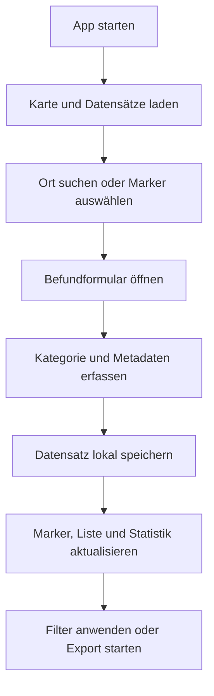

## 1. Produktüberblick
Eine lokale Web-App zur Erfassung, Pflege und Visualisierung linguistischer Befunde auf einer interaktiven Italien-Karte.
- Das Produkt unterstützt Forschende dabei, Städte als Datenpunkte zu verwalten und pro Ort zu dokumentieren, ob relevante Verben mit `ar-` statt `re-` oder `ri-` beginnen.
- Der fachliche Mehrwert liegt in einer konsistenten, filterbaren und exportierbaren Datengrundlage für räumliche Analysen, Kartenansichten und spätere Weiterverarbeitung in Tabellenkalkulationen.

## 2. Kernfunktionen

### 2.1 Funktionsmodule
1. **Kartenansicht**: Italien-Karte mit Marker-Darstellung, Zoom, Legende und regionaler Orientierung.
2. **Ortsverwaltung**: Suche nach Städten, Auswahl vorhandener Orte und Anlegen neuer Einträge mit Koordinaten.
3. **Befunderfassung**: Formular zur Eingabe linguistischer Kategorien, Belegformen, Lemmas, Quellen und Kommentaren.
4. **Filter und Analyse**: Filter nach Kategorie, Bearbeitungsstatus, Region und Suchbegriff; Zählwerte in einer kompakten Statistikleiste.
5. **Datenexport und Persistenz**: Lokale Speicherung im Browser sowie Export nach `CSV` und `XLSX`.

### 2.2 Seitendetails
| Seitenname | Modulname | Funktionsbeschreibung |
|-----------|-------------|---------------------|
| Hauptansicht | Forschungs-Karte | Zeigt Italien mit interaktiven Markern, farblicher Kategorisierung und Legende an. |
| Hauptansicht | Such- und Filterleiste | Filtert Marker nach Kategorie (`ar`, `re/ri`, `beide`, `unklar`, `keine Daten`), Region, Status und Freitext. |
| Hauptansicht | Statistikleiste | Zeigt Anzahl der Orte insgesamt sowie je Kategorie in Echtzeit an. |
| Hauptansicht | Ortsdetails | Öffnet bei Klick auf Marker oder Listenzeile eine Detailansicht mit allen erfassten Angaben. |
| Hauptansicht | Befundformular | Ermöglicht das Anlegen, Bearbeiten und Löschen von Datensätzen inklusive Quelle und Kommentar. |
| Hauptansicht | Ortsliste | Stellt die gefilterten Orte tabellarisch dar und synchronisiert Auswahl mit der Karte. |
| Hauptansicht | Import/Export | Exportiert alle Datensätze nach `CSV` oder `XLSX` und ermöglicht späteren Re-Import strukturierter Daten. |

## 3. Kernablauf
Die Nutzerin öffnet die Karte, sucht eine Stadt oder navigiert auf der Karte zu einem Ort und wählt den zu bearbeitenden Punkt aus. Danach erfasst oder aktualisiert sie den linguistischen Befund inklusive Kategorie, Beleg und Quelle. Die Markerfarbe und die Statistik werden sofort aktualisiert. Über Filter kann die Nutzerin räumliche Verteilungen gezielt untersuchen und die Datensätze für die weitere Auswertung exportieren.

## 4. Gestaltung der Benutzeroberfläche
### 4.1 Designstil
- Primärfarben: tiefes Nachtblau für Panels, gedämpftes Elfenbein für Flächen, akzentuierte Markierungsfarben für linguistische Kategorien.
- Sekundärfarben: Ziegelrot (`ar`), Kobaltblau (`re/ri`), Violett (`beide`), Ocker (`unklar`), Schiefergrau (`keine Daten`).
- Button-Stil: klar konturiert, leicht abgerundet, mit dezenten Hover-Übergängen.
- Typografie: charaktervolle Display-Schrift für Überschriften, gut lesbare Serif- oder Humanist-Schrift für Forschungsdaten und Fließtext.
- Layout-Stil: Desktop-first mit breiter Kartenfläche links, Forschungswerkzeugen rechts und kompakten Statistikmodulen im Kopfbereich.
- Icon-Stil: reduzierte, fachlich-seriöse Symbole ohne spielerische Illustration.

### 4.2 Gestaltungsübersicht
| Seitenname | Modulname | UI-Elemente |
|-----------|-------------|-------------|
| Hauptansicht | Kopfbereich | Projekttitel, Kurzbeschreibung, Statistikchips, Exportaktionen |
| Hauptansicht | Kartenbereich | Leaflet-Karte, Legende, Zoomsteuerung, thematische Marker |
| Hauptansicht | Werkzeugspalte | Suchfeld, Filtergruppen, aktive Filteranzeige, Reset-Aktion |
| Hauptansicht | Formularbereich | Auswahlfelder, Textfelder, Koordinatenfelder, Speichern/Löschen |
| Hauptansicht | Ortsliste | Tabellarische Übersicht mit Sortierung und Hervorhebung des aktiven Orts |

### 4.3 Responsivität
Das Interface ist desktop-first ausgelegt und passt sich auf kleinere Breiten mit gestapelten Bereichen an. Auf Tablets bleibt die Karte priorisiert sichtbar; auf Mobilgeräten werden Karte, Formular und Liste nacheinander zugänglich gemacht.
