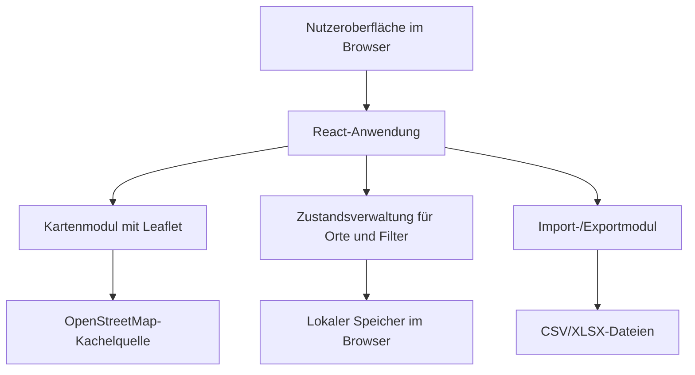
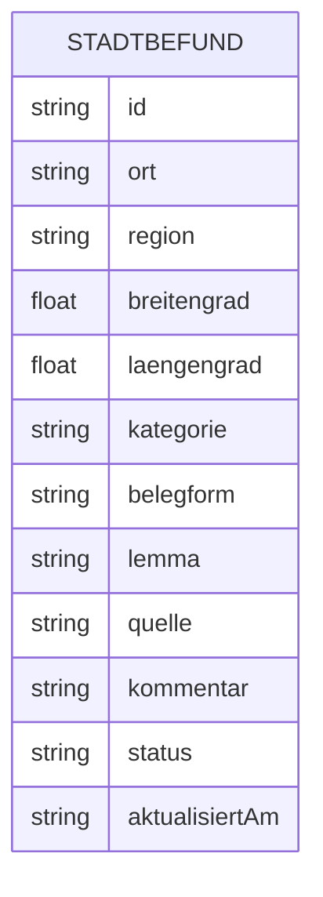

## 1. Architekturdesign


## 2. Technologiebeschreibung
- Frontend: `React 18` + `TypeScript` + `Vite`
- Styling: `Tailwind CSS 3` mit zusätzlichen CSS-Variablen für thematische Farben
- Kartenbibliothek: `Leaflet` + `react-leaflet`
- Datenaustausch: `xlsx` für Excel-Export, nativer CSV-Export für einfache Weitergabe
- Persistenz: `localStorage` für lokale Sitzungs- und Projektdaten ohne externes Backend
- Initialisierung: `Vite`

## 3. Routen-Definition
| Route | Zweck |
|-------|-------|
| / | Hauptansicht mit Karte, Filtern, Ortsliste und Befundformular |

## 4. API-Definitionen
Da die erste Version lokal ohne Backend arbeitet, werden keine externen HTTP-APIs benötigt. Die zentrale Datenschnittstelle ist ein internes Frontend-Datenmodell.

```ts
export type VerbKategorie = 'ar' | 're_ri' | 'beide' | 'unklar' | 'keine_daten';

export interface Stadtbefund {
  id: string;
  ort: string;
  region: string;
  breitengrad: number;
  laengengrad: number;
  kategorie: VerbKategorie;
  belegform: string;
  lemma: string;
  quelle: string;
  kommentar: string;
  status: 'offen' | 'geprueft';
  aktualisiertAm: string;
}

export interface Filterzustand {
  suche: string;
  region: string;
  kategorien: VerbKategorie[];
  status: 'alle' | 'offen' | 'geprueft';
}
```

## 5. Datenmodell
### 5.1 Datenmodell-Definition


### 5.2 Daten- und Speicherlogik
- Alle Datensätze werden als Array von `Stadtbefund`-Objekten im Browser gehalten.
- Änderungen werden nach jedem Speichern automatisch in `localStorage` persistiert.
- Export erzeugt aus dem aktuellen Datenbestand eine `CSV`- oder `XLSX`-Datei mit sprechenden Spaltennamen.
- Die Architektur bleibt bewusst backendfrei, damit das Werkzeug lokal, datensparsam und unkompliziert im Forschungsalltag einsetzbar ist.

## 6. Komponentenstruktur
- `AppShell`: Layout, Kopfbereich und globale Steuerung.
- `ItalyMap`: Leaflet-Karte, Marker, Popups und Kartenlegende.
- `FilterPanel`: Suchfeld, Kategorie- und Statusfilter, Regionseinschränkung.
- `LocationTable`: gefilterte tabellarische Ortsliste mit Auswahlzustand.
- `EntryForm`: Formular für Erfassung und Bearbeitung eines Befunds.
- `StatsBar`: Kennzahlen pro Kategorie und Gesamtmenge.
- `exportUtils`: CSV/XLSX-Erzeugung und Dateinamenlogik.

## 7. Qualitäts- und Umsetzungsentscheidungen
- Desktop-first, da die primäre Nutzung im Forschungs- und Büro-Kontext erfolgt.
- Keine externe Datenbank in Version 1, um Komplexität und Wartungsaufwand gering zu halten.
- Markerfarben und Legende müssen für die Kategorien konsistent und kontrastreich sein.
- Alle Kernfunktionen müssen ohne Internetzugang für Datenspeicherung arbeiten; nur Kartenkacheln benötigen eine Verbindung.
